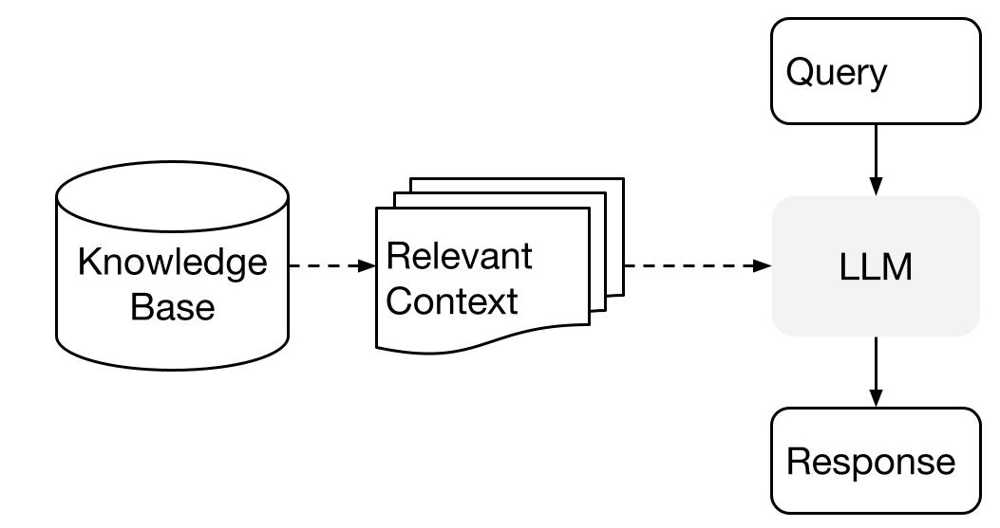

`Ta dokumentacja została przetłumaczona automatycznie i może zawierać błędy. Nie wahaj się otworzyć Pull Request, aby zaproponować zmiany.`

# Wysokopoziomowe koncepcje

LlamaIndex.TS pomaga w budowaniu aplikacji opartych na LLM (np. pytania i odpowiedzi, chatbot) na podstawie niestandardowych danych.

W tym przewodniku po wysokopoziomowych koncepcjach dowiesz się:

- jak LLM może odpowiadać na pytania przy użyciu twoich własnych danych.
- kluczowe koncepcje i moduły w LlamaIndex.TS do tworzenia własnego potoku zapytań.

## Odpowiadanie na pytania w oparciu o Twoje dane

LlamaIndex używa dwuetapowej metody podczas korzystania z LLM wraz z danymi:

1. **etap indeksowania**: przygotowanie bazy wiedzy, oraz
2. **etap zapytania**: pobieranie odpowiedniego kontekstu z wiedzy, aby pomóc LLM w udzieleniu odpowiedzi na pytanie.

Ten proces jest również znany jako Retrieval Augmented Generation (RAG).

LlamaIndex.TS dostarcza niezbędnego narzędzia do wykonania obu etapów w sposób bardzo prosty.

Przeanalizujmy teraz każdy etap szczegółowo.

### Etap indeksowania

LlamaIndex.TS pomaga w przygotowaniu bazy wiedzy za pomocą zestawu konektorów danych i indeksów.

[**Ładowarki danych**](./modules/high_level/data_loader.md):
Konektor danych (tj. `Reader`) pobiera dane z różnych źródeł danych i formatów danych do prostego reprezentacji `Document` (tekst i proste metadane).

[**Dokumenty / Węzły**](./modules/high_level/documents_and_nodes.md): `Document` to ogólny kontener dla dowolnego źródła danych - na przykład pliku PDF, wyniku API lub pobranych danych z bazy danych. `Node` to atomowa jednostka danych w LlamaIndex i reprezentuje "kawałek" źródłowego `Document`. Jest to bogata reprezentacja, która zawiera metadane i relacje (do innych węzłów), umożliwiające dokładne i wyraźne operacje wyszukiwania.

[**Indeksy danych**](./modules/high_level/data_index.md):
Po załadowaniu danych LlamaIndex pomaga w indeksowaniu danych w formacie, który jest łatwy do pobrania.

Pod spodem LlamaIndex analizuje surowe dokumenty na pośrednie reprezentacje, oblicza osadzenia wektorowe i przechowuje Twoje dane w pamięci lub na dysku.

"

### Etap zapytania

W etapie zapytania, potok zapytań pobiera najbardziej odpowiedni kontekst na podstawie zapytania użytkownika,
a następnie przekazuje go do LLM (wraz z zapytaniem) w celu syntezowania odpowiedzi.

Daje to LLM aktualną wiedzę, która nie znajduje się w jego oryginalnych danych treningowych,
(co również zmniejsza halucynacje).

Największym wyzwaniem na etapie zapytania jest pobieranie, zarządzanie i wnioskowanie na podstawie (potencjalnie wielu) baz wiedzy.

LlamaIndex dostarcza moduły, które można komponować, aby pomóc w budowaniu i integracji potoków RAG dla pytań i odpowiedzi (silnik zapytań), chatbotów (silnik chatu) lub jako część agenta.

Te podstawowe elementy można dostosować, aby odzwierciedlały preferencje rankingowe, a także komponować w celu wnioskowania na podstawie wielu baz wiedzy w strukturalny sposób.

#### Podstawowe elementy

[**Retrievers**](./modules/low_level/retriever.md):
Retriever definiuje sposób efektywnego pobierania odpowiedniego kontekstu z bazy wiedzy (tj. indeksu) na podstawie zapytania.
Konkretna logika pobierania różni się w zależności od różnych indeksów, najpopularniejszym jest gęste pobieranie na podstawie indeksu wektorowego.

[**Response Synthesizers**](./modules/low_level/response_synthesizer.md):
Response Synthesizer generuje odpowiedź na podstawie LLM, używając zapytania użytkownika i określonego zestawu pobranych fragmentów tekstu.

"

#### Potoki

[**Silniki zapytań**](./modules/high_level/query_engine.md):
Silnik zapytań to potok od początku do końca, który umożliwia zadawanie pytań na podstawie danych.
Przyjmuje zapytanie w naturalnym języku i zwraca odpowiedź wraz z pobranym kontekstem referencyjnym przekazanym do LLM.

[**Silniki chatu**](./modules/high_level/chat_engine.md):
Silnik chatu to potok od początku do końca, który umożliwia prowadzenie rozmowy z danymi
(wielokrotne pytania i odpowiedzi zamiast pojedynczego pytania i odpowiedzi).

"
